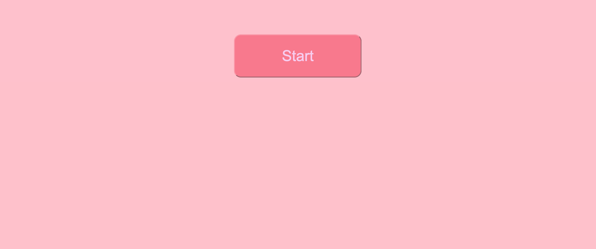

# Timed Coding Quiz

- [Usage](#usage)

- [Contributors](#contributors)

- [Questions](#questions)

## Description

This is a timed coding quiz asking questions related to your favorite things, such as your favorite color and what the best state is in your opinion.

[Repo page](https://github.com/Halimaxo/timed-coding-quiz)

[Deployed page](https://halimaxo.github.io/timed-coding-quiz/)

## Usage

You can take this fun short quiz with your friends to see what each of you enjoy!

## Contributors

Had help from my wonderful tutor Abdullah Al-Hilfi

## Questions

For further questions reach out to me using my GitHub Profile or email:
Halimaxo
